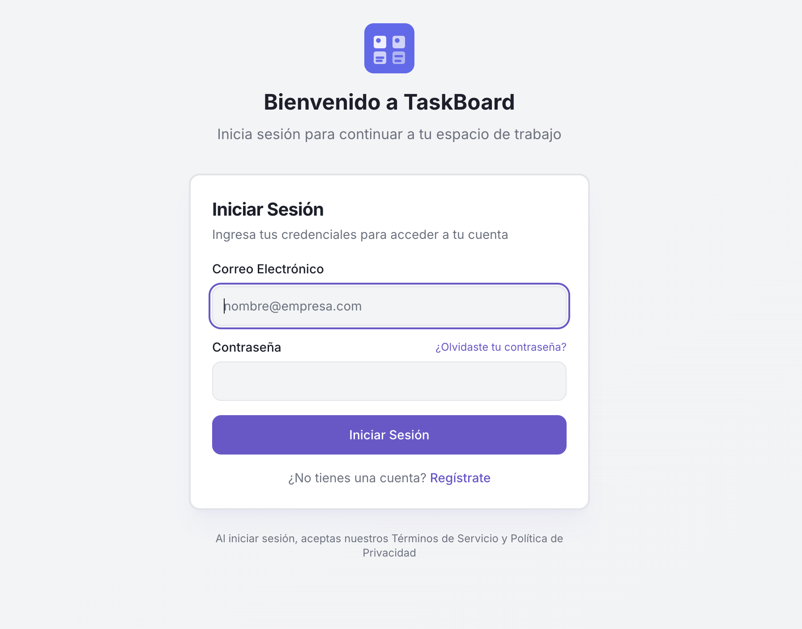
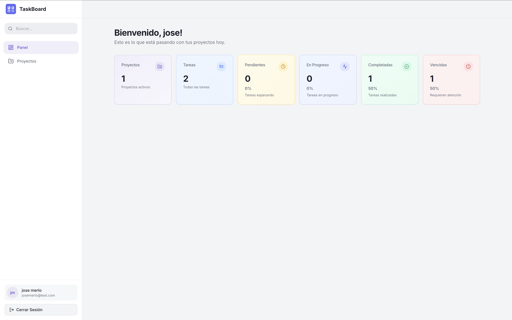
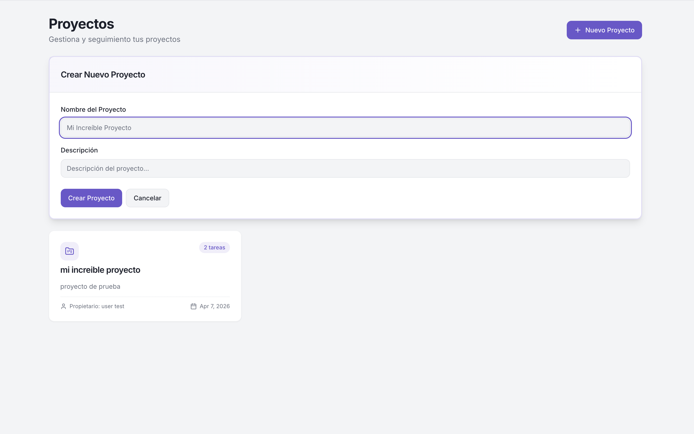
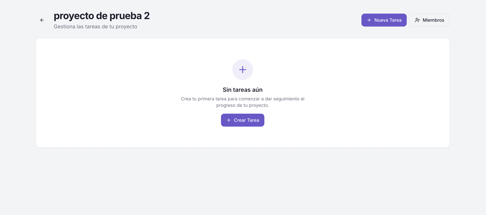
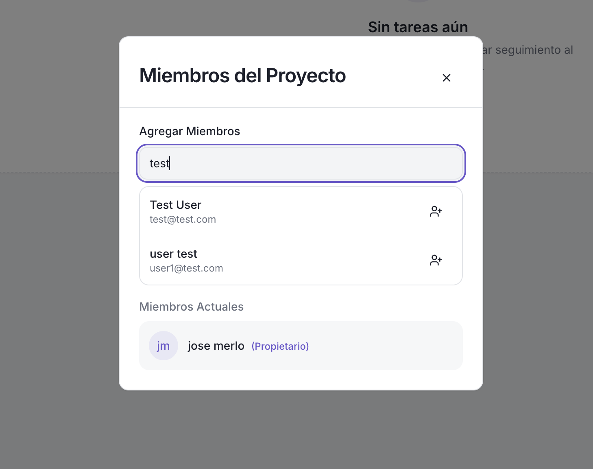

# TaskBoard

A personal project management application built with Rails 8 + React + Vite.

## Screenshots

### Login


### Registro


### Dashboard


### Proyectos


### Tareas


## Acerca del Proyecto

TaskBoard es una aplicación personal de gestión de proyectos desarrollada para organizar tareas y proyectos de forma eficiente. Permite crear proyectos, agregar tareas, asignar miembros y hacer seguimiento del estado de cada tarea.

### Características Principales

- **Gestión de Proyectos**: Crear, editar y eliminar proyectos
- **Gestión de Tareas**: Crear tareas con fecha límite, asignar responsables y cambiar estados
- **Estados de Tareas**: Pendiente, En Progreso, Completada, Vencida
- **Agregar Miembros**: Invitar usuarios a proyectos
- **Dashboard**: Vista general con estadísticas de tareas
- **Autenticación JWT**: Login y registro seguro con tokens

### Tecnología

- **Backend**: Ruby on Rails 8
- **Frontend**: React + TypeScript + Vite
- **Base de Datos**: SQLite3
- **Autenticación**: JWT con Devise
- **Jobs**: Sidekiq para tareas programadas
- **Estilos**: TailwindCSS

## Desarrollo

Este proyecto fue desarrollado con la asistencia de **OpenCode**, una herramienta de IA que ayuda en tareas de ingeniería de software. OpenCode fue utilizado como guía para:

- Análisis y corrección de bugs
- Mejoras de seguridad
- Documentación tecnica del proyecto

### Instalación de Dependencias

```bash
# Instalar dependencias Ruby
bundle install

# Instalar dependencias Node
npm install

# Compilar assets del frontend (requerido para producción)
npm run build

# Configurar base de datos
bin/rails db:create db:migrate

# Crear usuario de prueba (opcional)
bin/rails runner "User.create!(email: 'test@test.com', password: 'password', password_confirmation: 'password', first_name: 'Test', last_name: 'User')"
```

### Ejecutar la Aplicación

```bash
# Desarrollo (dos terminales)

# Terminal 1: Servidor Rails
bin/rails server -p 3000

# Terminal 2: Servidor de desarrollo Vite
npm run dev
```

Luego abre http://localhost:5173

### Credenciales de Prueba

- Email: `user1@test.com`
- Password: `123456`

## Jobs Programados

### CheckOverdueTasksJob

Job que se ejecuta automáticamente a las 00:05 diario para marcar tareas vencidas.

```bash
# Ejecutar manualmente
bundle exec rails runner "CheckOverdueTasksJob.perform_now"
```

## Despliegue

Los assets compilados no se incluyen en el repositorio. Al hacer despliegue con Kamal, asegurate de ejecutar `npm run build` durante el despliegue.
